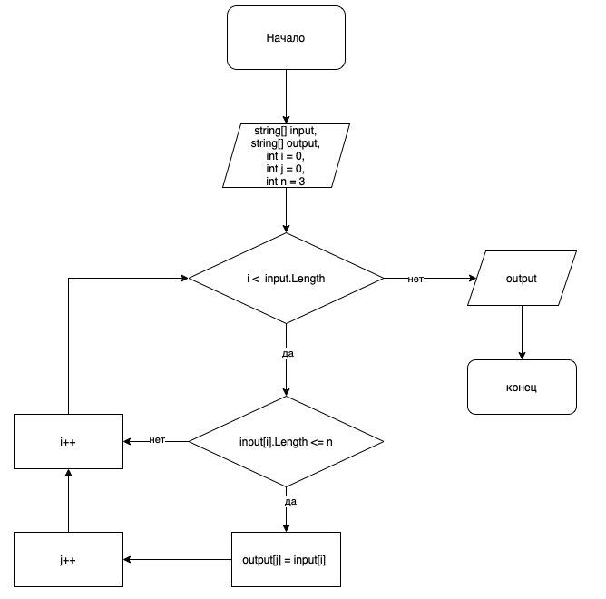

# **ПРОВЕРОЧНАЯ РАБОТА**

## ЗАДАЧА:
Написать программу, которая из имеющегося массива строк формирует массив из строк, длина которых меньше либо равна 3 символа. Первоначальный массив можно ввести с клавиатуры, либо задать на старте выполнения алгоритма. При решение не рекомендуется пользоваться коллекциями, лучше обойтись исключительно массивами.

## Алгоритм выполнения задания:
1. Создать репозиторий на GitHub
2. Нарисовать блок-схему алгоритма
3. Снабдить репозиторий оформленным текстовым описанием решения (файл README.md)
4. Написать программу, решающую поставленную задачу
5. Использовать контроль версий в работе над этим небольшим проектом (не должно быть так, что все залито одним коммитом, как минимум этапы 2, 3 и 4 должны быть расположены в разных коммитах)

## *Задание 2. Блок-схема алгоритма решения*

## *Задание 3. Описание алгоритма решения*

1. Делаем перебор значений из исходного массива
2. Проверяем каждое значение из массива на соответствие условию: строки, длина которых меньше, либо равна 3 символам
3. Если строка удовлетворяет условию, кладем значение в новый массив
4. Проделываем данный алгоритм пока не достигнем конца исходного массива
5. Возвращаем новый заполненный массив как результат
